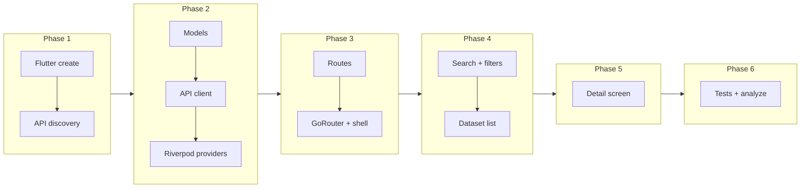

# Serbia Open Data Explorer – Implementation Plan

## Current state

- **Codebase:** Empty. No `pubspec.yaml`, no `lib/`, no Flutter app.
- **Defined:** [.cursor/rules/ProjectRules.md](.cursor/rules/ProjectRules.md) (features, API, Riverpod, TDD), [.cursor/rules/GlobalRules.md](.cursor/rules/GlobalRules.md) (workflow, TDD, git), and [.cursor/skills/flutter-developer/](.cursor/skills/flutter-developer/) (navigation, patterns; written for another app but usable as reference).

## Constraints and decisions

- **State:** Riverpod (per ProjectRules). No Supabase/auth in scope.
- **API:** [https://data.gov.rs/api/](https://data.gov.rs/api/) — exact base path and actions must be confirmed in Phase 1 (portal may use CKAN-style `/api/3/action/...` or similar).
- **TDD:** Per GlobalRules: write failing test first, then minimal code to pass, then refactor. Applies to data layer and features.
- **Workflow:** Backend (API + models) first, then frontend (screens), then tests for both (per ProjectRules). Plan is ordered to support that.

---

## Phase 1: Project bootstrap and API discovery

**Goal:** Working Flutter app and a clear contract for the data.gov.rs API.

**Tasks:**

- Create Flutter project with `flutter create` in repo root
- Add `flutter_riverpod`, `go_router`, `http`/`dio`, `build_runner`, `url_launcher` to pubspec
- Run `flutter analyze` and fix until clean
- Call data.gov.rs API and document base URL, list/detail actions, response shapes
- Write API discovery note (base URL, endpoints, filter params) in repo

1. **Create Flutter project**

- Run `flutter create .` in repo root (or create project in subdir if you prefer; then all paths below are relative to that).
- Add dependencies: `flutter_riverpod`, `riverpod_annotation`, `riverpod_generator`, `go_router`, `http` (or `dio`). Add `build_runner` and `custom_lint` (and riverpod_lint if desired) for code generation.
- Ensure `flutter analyze` is clean.

1. **Discover data.gov.rs API**

- Call the base URL (e.g. `https://data.gov.rs/api/` or `https://data.gov.rs/api/3/action/`) and document:
  - Exact base URL and path (e.g. `/api/3/action/`).
  - List action (e.g. `package_list` or `package_search`) and response shape.
  - Detail action (e.g. `package_show` with id) and response shape.
  - How to filter by organization, license, frequency, format (query params or `fq` etc.).
- Record findings in a short **API discovery note** (in repo or doc) so the next phase has a single source of truth. No code yet.

**Deliverables:** Flutter project that runs, dependency list, API discovery note with base URL, list/detail endpoints, and filter parameters.

---

## Phase 2: Data layer (Backend-first)

**Goal:** Typed models and a single place that talks to data.gov.rs. All access from UI goes through this layer. TDD: tests first, then implementation.

**Tasks:**

- Define Dataset and DatasetDetail model classes in `lib/src/data/models/`
- Add ABOUTME 2-line file comments to all new files (GlobalRules)
- Write failing tests for API client (search, getById, error handling) — TDD first
- Implement `DataGovRsApiClient` with `searchDatasets` and `getDatasetById`
- Add `dataGovRsApiClientProvider`, `datasetSearchResultsProvider`, `datasetDetailProvider`
- Add tests for providers; use real API or JSON fixtures, no mocks-only tests

1. **Models (from API discovery)**

- Define Dart classes for:
  - Dataset list item (id, title, description/snippet, organization, license, frequency, formats, etc. as exposed by the API).
  - Dataset detail (full description, publisher, update frequency, list of resources with download links and format).
- Location suggestion: `lib/src/data/models/` (e.g. `dataset.dart`, `dataset_detail.dart` or one file if small). Add `ABOUTME:` 2-line file comments per GlobalRules.

1. **API client**

- Single class (e.g. `DataGovRsApiClient`) that:
  - Takes base URL (from config/env or constant from discovery).
  - Implements: `searchDatasets({query, organization, license, frequency, format, page, limit})` and `getDatasetById(String id)`.
  - Uses `http` or `dio`, returns parsed models or throws.
- Location: e.g. `lib/src/data/api/data_gov_rs_api_client.dart`.
- **TDD:** Write tests that either hit the real API (preferred per GlobalRules) or, if you decide to use a thin wrapper, test the parsing logic with real JSON fixtures. No tests that only assert on mocks.

1. **Riverpod providers**

- Provider that supplies `DataGovRsApiClient` (e.g. `dataGovRsApiClientProvider`).
- Provider(s) that expose search state: e.g. `datasetSearchQueryProvider` (state), `datasetSearchResultsProvider` (async, depends on query + filters and calls client). Optionally separate filter providers (organization, license, frequency, format).
- Provider for detail: `datasetDetailProvider(id)` that calls `getDatasetById(id)`.
- Location: e.g. `lib/src/data/providers/dataset_providers.dart` (or split by domain if it grows).

**Deliverables:** Models, API client, Riverpod providers, and tests for them. No UI yet.

---

## Phase 3: Navigation and app shell

**Goal:** GoRouter setup and a minimal shell so every screen lives inside the same navigation.

**Tasks:**

- Create `app_routes.dart` with home and datasetDetail path constants
- Configure GoRouter with home and `/dataset/:id` routes
- Set up `main.dart` with ProviderScope and MaterialApp.router
- Add ShellRoute with simple scaffold and placeholder home/detail screens
- Run app and verify navigation between placeholders works

1. **Route constants**

- Define a single place for route paths (e.g. `lib/src/routing/app_routes.dart`): e.g. `home`, `datasetDetail` with `:id`. No hardcoded route strings in widgets (per Flutter skill).

1. **GoRouter configuration**

- Configure routes: home (catalog/search), dataset detail (`/dataset/:id`). Use path params for `id` (per [NAVIGATION.md](.cursor/skills/flutter-developer/NAVIGATION.md)).
- No auth/guards in v1 (public catalog).

1. **App entry and shell**

- `main.dart`: `ProviderScope` wrapping the app, then `MaterialApp.router` with the GoRouter.
- Optional: `ShellRoute` with a simple scaffold (e.g. app bar + `child`) for consistent layout; home and detail can be children.

**Deliverables:** Running app that can navigate to a placeholder home and a placeholder detail (e.g. show id in a Text). No real UI content yet.

---

## Phase 4: Catalog UI (search and filters)

**Goal:** Home screen: search input, filters (organization, license, frequency, format), and list of datasets.

**Tasks:**

- Add search text field wired to search query provider (debounced or on submit)
- Add filter dropdowns/chips for organization, license, frequency, format
- Build dataset list view with loading, error, empty, success states
- On list item tap, navigate to detail using route constant
- Add SnackBar/inline error and loading handling; check `mounted` after async

1. **Search and filter UI**

- Search: text field that updates `datasetSearchQueryProvider` (or a notifier) on submit or debounced.
- Filters: dropdowns or chips for organization, license, frequency, format. Options can be loaded from the API (if list endpoints exist) or from a fixed list derived from discovery. Filter state in Riverpod (same or separate providers as in Phase 2).
- Connect filter state to `datasetSearchResultsProvider` so changing filters refetches.

1. **Dataset list**

- List view (e.g. `ListView` or scrollable list) that reads `datasetSearchResultsProvider`: show loading, error, empty, and success (title, short description, organization/format chips). On tap, navigate to detail with `context.push('/dataset/${id}')` (using route constant).

1. **Error and loading**

- Use try/catch and Riverpod async states; show user-friendly messages (SnackBar or inline). Check `mounted` after async before using `context` (per Flutter skill).

**Deliverables:** Home screen with working search, filters, and list; navigation to detail by id.

---

## Phase 5: Dataset detail screen

**Goal:** Detail page shows description, publisher, update frequency, and download links.

1. **Detail screen**

- Route reads `:id` from path, uses `datasetDetailProvider(id)`.
- Display: full description, publisher, update frequency, list of resources (name + format + download link). Use `url_launcher` (or platform link handling) for download links.

1. **States**

- Loading, error, and success; no use of `context` after async without `mounted` check.

**Deliverables:** Detail screen with all required fields and working download links.

---

## Phase 6: Tests and quality

**Goal:** Tests for data layer and critical flows; `flutter analyze` and `flutter test` passing.

1. **Data layer**

- Ensure API client and providers have tests (real API or real JSON fixtures; no tests that only assert on mocks). Cover at least: search with query/filters, get by id, error handling.

1. **Widget / integration**

- At least one widget or integration test that verifies: open app → (optional: enter search) → tap a dataset → detail screen shows expected data or link. Kept minimal but meaningful.

1. **Quality**

- `flutter analyze` clean; all tests green; coverage maintained as required (e.g. ≥80% if specified).

**Deliverables:** Test suite passing, no analyzer issues, handoff-ready.

---

## Suggested directory layout

```text
lib/
  src/
    data/
      api/
        data_gov_rs_api_client.dart
      models/
        dataset.dart
      providers/
        dataset_providers.dart
    routing/
      app_routes.dart
      app_router.dart
  app.dart
  main.dart
test/
  ... (mirror or feature-based)
```

---

## Dependencies (to add in Phase 1)

- `flutter_riverpod` + `riverpod_annotation` + `riverpod_generator` (and `build_runner`, `custom_lint` if using generated code).
- `go_router`.
- `http` or `dio`.
- `url_launcher` (for download links).

---

## Risk and follow-up

- **API shape:** If data.gov.rs differs from CKAN (e.g. different base path or action names), Phase 1 discovery is mandatory; Phase 2 models and client must follow the actual responses.
- **Design:** Plan uses Material 3 by default. If you later add a design system (e.g. a local package or tokens), it can be introduced in Phase 4/5 without changing this plan’s structure.
- **Git:** Per GlobalRules, initialize git if missing; use WIP branches and small commits per phase.

---

## Mermaid: high-level flow


